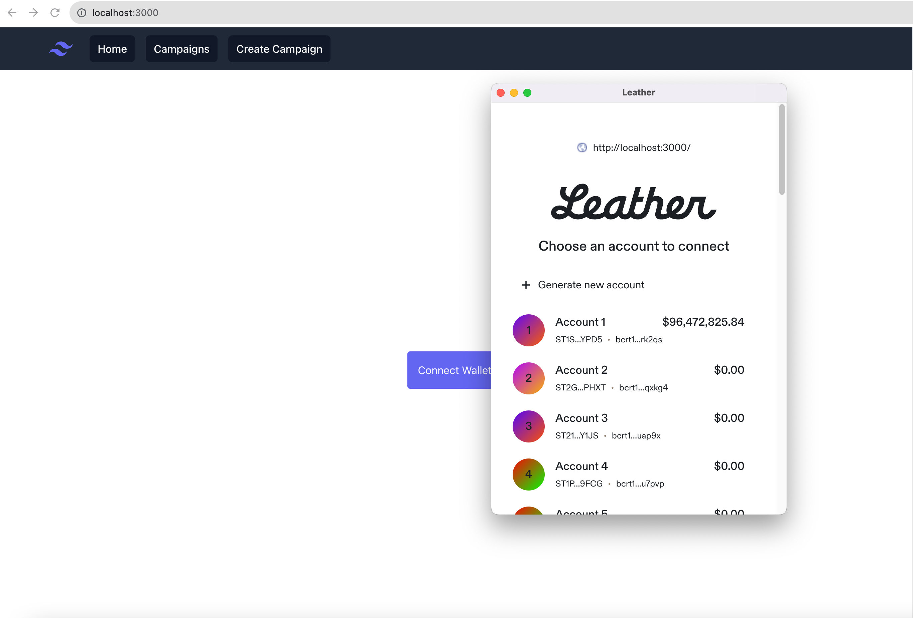

# Getting Started with Create React App

This project was bootstrapped with [Create React App](https://github.com/facebook/create-react-app).

## Clarity Testing

In the `crowdfunding` project directory, you can run:

### `npm run test-contracts`

Runs the Clarity SDK unit tests agaisnt the `crowdfunding.clar` smart contract.

### Load contracts in a console

The Clarinet console is an interactive Clarity REPL environment that runs in-memory. Any contracts in the current project will be
automatically loaded into memory.

```bash
clarinet console
```

You can use the `::help` command in the console for a list of valid commands, which can control the state of the
REPL chain, and allow you advance the chain tip. Additionally, you can enter Clarity commands into the console and observe
the result of the command.

You can exit the console by pressing `Ctrl + C` twice.

Changes to contracts are not loaded into the console while it is running. If you make any changes to your contracts you
must exit the console and run it again.

### Running a Local Stacks Devnet

Make sure you have Docker installed and running, run 
```bash
clarinet integrate
```

It will take a few minutes to get up and running, but then we can open up our local Stacks block explorer.
Once it finishes, visit the local block explorer at `localhost:8000`. You'll be able to see blocks as they are created and also see our `crowdfunding` contract deployment.

### Check your contracts

Clarinet provides syntax and semantics checkers for Clarity, which enable you to check if the Clarity code in your project is valid by using the following command:

```bash
clarinet check
```

This command uses the `Clarinet.toml` file to locate and analyze all of the contracts in the project. If the Clarity code is valid, the command will indicate success with the following message:

```
✔ 2 contracts checked
```

The checker may also report warnings that indicate the code is valid; however, you should be aware of a specific condition that might arise. For example, the check-checker analysis discussed below will generate warnings. If there are errors in the code, the output of the command will indicate the kind and location of the errors.

You may also perform syntax-check on a single file by using the following command.

```bash
clarinet check <path/to/file.clar>
```

If there are no syntax errors, the output of the command will be a success message similar to the example below.

```
✔ Syntax of contract successfully checked
```

**Note** Any syntactical errors in the Clarity code will be reported, but type-checking and other semantic checks will not be performed because Clarinet will only look at this one contract, since it does not have the full context to perform a complete check.

### Static Analysis

#### Check-Checker

The check-checker is a static analysis pass you can use to help find potential vulnerabilities in your contracts. To enable this pass, add the following lines to your `Clarinet.toml` file:

```toml
[repl.analysis]
passes = ["check_checker"]
```

The check-checker pass analyzes your contract to identify places where untrusted inputs might be used in a potentially dangerous way. Since public functions can be called by anyone, any arguments passed to these public functions should be considered untrusted. This analysis pass takes the opinion that all untrusted data must be checked before being used to modify the state on the blockchain. Modifying the state includes any operations that affect wallet balances, or any data stored in your contracts.

- Actions on Stacks wallets:
  - stx-burn?
  - stx-transfer?
- Actions on fungible tokens:
  - ft-burn?
  - ft-mint?
  - ft-transfer?
- Actions on non-fungible tokens:
  - nft-burn?
  - nft-mint?
  - nft-transfer?
- Actions on persisted data:
  - Maps:
    - map-delete
    - map-insert
    - map-set
  - Variables:
    - var-set

In addition to those operations, the check-checker is also a bit opinionated and prefers that untrusted data be checked near the source, making the code more readable and maintainable. For this reason, the check-checker also requires that arguments passed into private functions and return values must be checked.

- Calls to private functions
- Return values

Finally, another opportunity for exploits appears when contracts call functions from traits. Those traits are untrusted, just like other parameters to public functions, so they are also required to be checked.

- Dynamic contract calls (through traits)

When an untrusted input is used in one of these ways, you will see a warning like this:

```
bank:27:37: warning: use of potentially unchecked data
        (as-contract (stx-transfer? (to-uint amount) tx-sender customer))
                                    ^~~~~~~~~~~~~~~~
bank:21:36: note: source of untrusted input here
(define-public (withdrawal-unsafe (amount int))
```

In the case where an operation affects only the sender's own wallet (e.g. calling `stx-transfer?` with the sender set to `tx-sender`), then there is no need to generate a warning, because the untrusted input is only affecting the sender, who is the source of that input. To put it another way, the sender should be able to safely specify parameters in an operation that affects only themselves. This sender is also potentially protected by post-conditions.

For a more detailed description on how to use the Check-Checker, please see the [Catch Smart Contract Vulnerabilities With Clarinet’s Check-Checker Feature](https://www.youtube.com/watch?v=v2qXFL2owC8&list=PL5Ujm489LoJaAz9kUJm8lYUWdGJ2AnQTb&index=14) YouTube video.

##### Options

The check-checker provides some options that can be specified in `Clarinet.toml` to handle common usage scenarios that may reduce false positives from the analysis:

```toml
[repl.analysis.check_checker]
strict = false
trusted_sender = true
trusted_caller = true
callee_filter = true
```

If `strict` is set to true, all other options are ignored and the analysis proceeds with the most strict interpretation of the rules.

The `trusted_sender` and `trusted_caller` options handle a common practice in smart contracts where there is a concept of a trusted transaction sender (or transaction caller), which is treated like an admin user. Once a check has been performed to validate the sender (or caller), then all inputs should be trusted.

In the example below, the `asserts!` on line 3 is verifying the `tx-sender`. Because of that check, all inputs are trusted (if the `trusted_sender` option is enabled):

```clarity
(define-public (take (amount int) (from principal))
    (let ((balance (- (default-to 0 (get amount (map-get? accounts {holder: from}))) amount)))
        (asserts! (is-eq tx-sender (var-get bank-owner)) err-unauthorized)
        (map-set accounts {holder: from} {amount: balance})
        (stx-transfer? (to-uint amount) (as-contract tx-sender) tx-sender)
    )
)
```

The `callee_filter` option loosens the restriction on passing untrusted data to private functions, and instead, allows checks in a called function to propagate up to the caller. This is helpful, because it allows you to define input checks in a function that can be reused.

In the example below, the private function `validate` checks its parameter. The public function `save` calls `validate`, and when the `callee_filter` option is enabled, that call to `validate` will count as a check for the untrusted input, `amount`, resulting in no warnings from the check-checker.

```clarity
(define-public (save (amount uint))
    (begin
        (try! (validate amount))
        (var-set saved amount)
        (ok amount)
    )
)

(define-private (validate (amount uint))
    (let ((current (var-get saved)))
        (asserts! (> amount current) err-too-low)
        (asserts! (<= amount (* current u2)) err-too-high)
        (ok amount)
    )
)
```

## Available Scripts
In the `crowdfunding` project directory, you can run:

### `npm start`

Runs the app in the development mode.\
Open [http://localhost:3000](http://localhost:3000) to view it in the browser.

The page will reload if you make edits.\
You will also see any lint errors in the console.

### `npm test`

Launches the test runner in the interactive watch mode.\
See the section about [running tests](https://facebook.github.io/create-react-app/docs/running-tests) for more information.

### `npm run build`

Builds the app for production to the `build` folder.\
It correctly bundles React in production mode and optimizes the build for the best performance.

The build is minified and the filenames include the hashes.\
Your app is ready to be deployed!

See the section about [deployment](https://facebook.github.io/create-react-app/docs/deployment) for more information.

### `npm run eject`

**Note: this is a one-way operation. Once you `eject`, you can’t go back!**

If you aren’t satisfied with the build tool and configuration choices, you can `eject` at any time. This command will remove the single build dependency from your project.

Instead, it will copy all the configuration files and the transitive dependencies (webpack, Babel, ESLint, etc) right into your project so you have full control over them. All of the commands except `eject` will still work, but they will point to the copied scripts so you can tweak them. At this point you’re on your own.

You don’t have to ever use `eject`. The curated feature set is suitable for small and middle deployments, and you shouldn’t feel obligated to use this feature. However we understand that this tool wouldn’t be useful if you couldn’t customize it when you are ready for it.

### Frontend Demo





